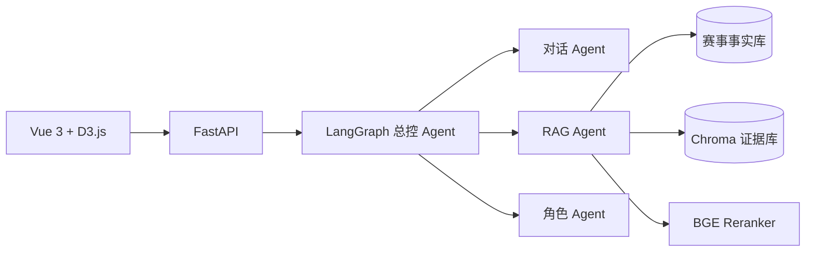

# World Cup RAG Agent

面向世界杯赛事胜负、比分、晋级关系与历史事实问答的多 Agent RAG 知识库项目。

## 项目目标

- 将比赛、球队、比分、阶段、晋级关系等确定性事实存入结构化数据库。
- 将新闻、战报、规则说明等文本证据向量化存入 Chroma。
- 使用 LangGraph 编排对话、检索、角色与可视化 Agent。
- 通过 FastAPI 提供统一接口，前端采用 Vue 3 与 D3.js 展示比赛关系图谱。
- 对所有事实答案返回来源，降低模型幻觉并支持追溯。

## 总体架构



## 运行 SQLite Live Demo

仓库内置 6 场 2022 年世界杯淘汰赛样例，可在不下载外部数据、无需大模型密钥的情况下运行真实 SQLite 查询和 LangGraph 精确问答：

```bash
# 1. 安装 Python 依赖
uv sync

# 2. 生成 data/generated/worldcup_demo.db 及配套事实文件
uv run python scripts/init_demo_data.py

# 3. 复制环境变量示例
cp .env.example .env
```

Windows PowerShell 可使用 `Copy-Item .env.example .env`。随后在 `.env` 中切换：

```dotenv
FRONTEND_DATA_MODE=sqlite
WORLD_CUP_DB_PATH=data/generated/worldcup_demo.db
AGENT_MODE=langgraph
```

启动后端：

```bash
uv run uvicorn backend.main:app --reload --host 0.0.0.0 --port 8000
```

另开终端启动前端：

```bash
cd frontend
npm ci
npm run dev
```

此离线 Demo 覆盖真实 SQLite 筛选、比赛详情及精确事实问答；需要 Chroma 和大模型的语义问答仍属于后续接入范围。

## 目录约定

```text
world-cup-rag-agent/
├─ backend/                 # FastAPI、LangGraph、检索与数据访问
│  └─ rag/prompts/          # RAG 生成与回答格式提示词
├─ frontend/                # Vue 3、D3.js 与交互界面
├─ data/                    # 数据说明；原始/生成数据默认不提交
├─ docs/                    # 架构、数据字典、接口与会议结论
├─ tests/                   # 单元、集成、检索评测与端到端测试
│  └─ evaluation/           # RAG 测试集、模拟数据与校验脚本
├─ .github/                 # PR 模板与仓库协作配置
└─ CONTRIBUTING.md          # 团队协作规范
```

## 分支模型

| 分支 | 用途 | 合并方式 |
|---|---|---|
| `main` | 稳定、可演示、可发布版本 | 仅接受来自 `develop` 或 `hotfix/*` 的 PR |
| `develop` | 日常集成与联调 | 接受 `feature/*`、`fix/*`、`docs/*`、`test/*` PR |
| `feature/<scope>` | 新功能开发 | 从 `develop` 创建，完成后 PR 回 `develop` |
| `fix/<scope>` | 非紧急缺陷修复 | 从 `develop` 创建，完成后 PR 回 `develop` |
| `hotfix/<scope>` | 线上或演示阻断问题 | 从 `main` 创建，并回合并到 `main` 与 `develop` |

建议首批功能分支：

- `feature/data-pipeline`
- `feature/retrieval`
- `feature/backend-agent`
- `feature/frontend`
- `feature/evaluation`

## 开始协作

```bash
git clone https://github.com/wretch0606/world-cup-rag-agent.git
cd world-cup-rag-agent
git switch develop
git pull --ff-only
git switch -c feature/<your-scope>
```

完成工作后推送功能分支，并向 `develop` 发起 Pull Request。禁止直接向 `main` 或 `develop` 推送业务提交。

完整规则见 [CONTRIBUTING.md](CONTRIBUTING.md) 与 [分支协作说明](docs/branching-strategy.md)。

