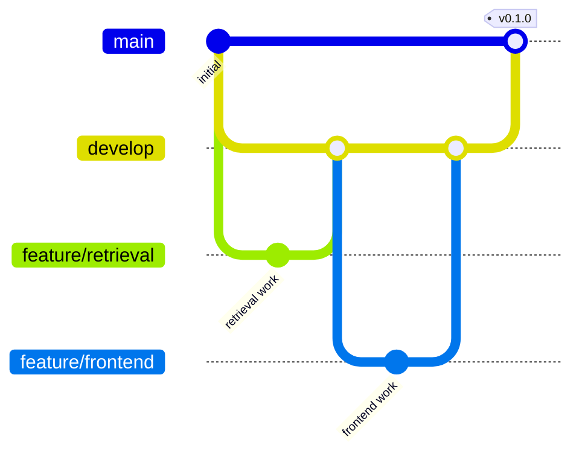

# 多分支协作说明

## 主干关系

## 仓库规则建议

### `main`

- 禁止直接推送。
- 必须通过 Pull Request 合并。
- 至少一名审查者批准。
- 新提交出现后撤销旧批准。
- 所有讨论解决后才能合并。
- 自动测试通过后才能合并。
- 使用 Squash merge，保持发布历史清晰。

### `develop`

- 禁止直接推送业务代码。
- 必须通过 Pull Request 合并。
- 至少一名审查者批准。
- 自动测试通过后才能合并。

## 组长统筹建议

- 用 GitHub Projects 或 Milestone 管理阶段目标。
- 每个任务只指定一名直接负责人，其他成员担任协作者或评审者。
- 每周至少一次把已验收的 `develop` 合入 `main`，并打版本标签。
- 数据、接口、提示词与评测集都要版本化，避免只在群聊中确认口径。
- 发生冲突时，由改动更晚且更了解业务的一方主导解决，另一方复核。

